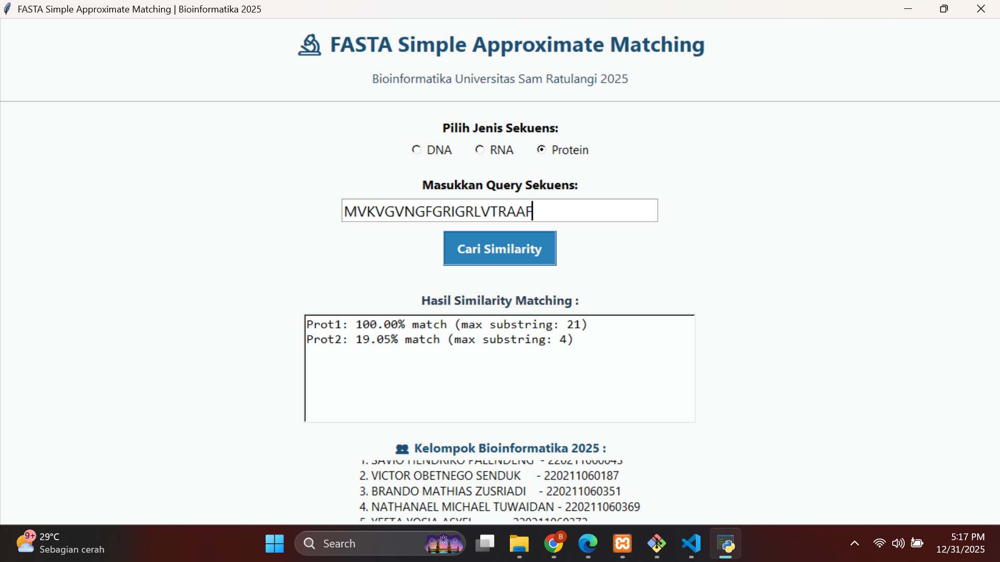
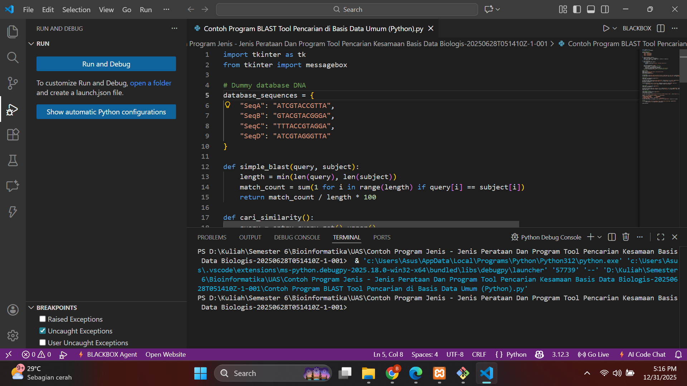

# 🧬 FASTA & BLAST – Simple Approximate Matching Tool

Aplikasi **TOOL Pencarian Kesamaan Basis Data Biologis** menggunakan pendekatan algoritmik sederhana dari **FASTA** dan **BLAST**.  
Proyek ini dikembangkan sebagai tugas akhir mata kuliah **Bioinformatika — Semester 6**  
Program Studi **Teknik Informatika — Universitas Sam Ratulangi**.

---

## 📌 Ringkasan Proyek

🔹 Implementasi program pencocokan sekuens biologis (DNA / RNA / Protein)  
🔹 Menerapkan metode **approximate matching**  
🔹 Menggunakan bahasa pemrograman **Python + Tkinter GUI**  
🔹 Terdiri dari dua aplikasi utama:

| Tool | Fungsi |
|------|--------|
| 🧫 **BLAST Simple Approximate Matching** | Mengukur kemiripan antar sekuens DNA berdasar posisi index |
| 🔬 **FASTA Simple Approximate Matching** | Mengukur panjang substring kemiripan terpanjang (longest match) |

---

## ⚙️ Teknologi yang Digunakan

- 🐍 Python 3
- 🖼 Tkinter GUI
- 📁 Dummy Sequence Database (Hard‑coded)
- 🧪 DNA / RNA / Protein Sequence Matching

---

## 🚀 Cara Menjalankan Program

### 1️⃣ Jalankan Program BLAST

```bash
python "Contoh Program BLAST Tool Pencarian di Basis Data Umum (Python).py"
```

### 2️⃣ Jalankan Program FASTA

```bash
python "Contoh Program FASTA Tool Pencarian di Basis Data Umum (Python).py"
```

Tidak memerlukan instalasi library tambahan.

---

## 🧫 Fitur Utama Aplikasi

### 🔹 BLAST Simple Matching
- Input query DNA
- Dibandingkan dengan sequence database
- Output berupa **persentase kemiripan (%)**
- Menggunakan metode **index‑position comparison**

### 🔹 FASTA Simple Matching
- Mendukung **DNA / RNA / Protein**
- Menghitung **longest matching substring**
- Output berupa:
  - persentase similarity
  - panjang substring match maksimum

---

## 🖼 Cuplikan Tampilan

> Tambahkan file screenshot dalam folder repository lalu sesuaikan path berikut:

**BLAST Application UI**  


**FASTA Application UI**  


**Run Program (VSCode)**  



---

## 👥 Anggota Kelompok

Bioinformatika — **Kelompok 3 — 2025**

- BRANDO M. ZUSRIADI
- NATHANAEL M. TUWAIDAN
- SAVIO H. PALENDENG
- VICTOR O. J. SENDUK
- YEFTA Y. ASYEL

---

## 🎯 Tujuan Pembelajaran

✔ Memahami konsep dasar *sequence alignment*  
✔ Mengimplementasikan logika **FASTA & BLAST sederhana**  
✔ Mendesain tool pencarian berbasis GUI  
✔ Menghubungkan konsep bioinformatika & komputasi

---

## 📄 Struktur Proyek (Ringkas)

```
📁 src/
 ├── Contoh Program BLAST Tool Pencarian di Basis Data Umum (Python).py
 ├── Contoh Program FASTA Tool Pencarian di Basis Data Umum (Python).py
📁 asset/
 ├── TampilanAplikasiBlast.png
 ├── TampilanAplikasiFasta.png
 ├── TampilanProgramBlast.png
 ├── TampilanProgramFasta.png
README.md
```

---

## 🏷 Catatan

> Program ini merupakan **versi edukasi / simplified model**  
> Bukan implementasi lengkap BLAST/FASTA akademik.

Digunakan untuk **pembelajaran logika dasar sequence matching**.

---

## 🏛 Institusi

📍 Program Studi **Teknik Informatika**  
💡 Fakultas Teknik – **Universitas Sam Ratulangi**

---

## 📝 Lisensi

Proyek ini dibuat untuk kepentingan pembelajaran akademik.
